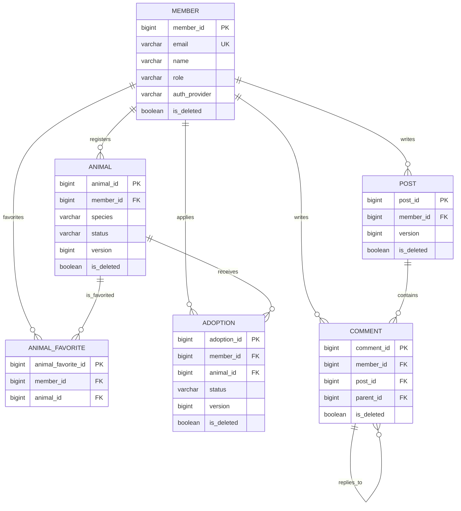

# 🐾 PawMate Backend

유기동물 입양 신청과 커뮤니티 기능을 제공하는 Spring Boot 백엔드입니다. 회원 인증, 이메일 인증, 카카오 OAuth2 로그인, JWT·Redis 토큰 관리, 입양 상태 관리와 분산 락 기반 동시성 제어를 포함합니다.

## 기술 스택

| 구분 | 사용 기술 |
| --- | --- |
| Language / Framework | Java 17, Spring Boot 3.5.3 |
| Persistence | Spring Data JPA, Hibernate, MySQL 8, H2(test) |
| Security | Spring Security, JWT (jjwt), OAuth2 Client |
| Cache / Lock | Redis, Redisson |
| API / Validation | SpringDoc OpenAPI, Jakarta Validation |
| Test | JUnit 5, AssertJ, Mockito |
| Build / Deploy | Gradle, Docker, Docker Compose |

## 주요 기능

- 회원가입, 로그인, JWT 재발급·로그아웃·회원 탈퇴
- 이메일 인증과 비밀번호 재설정
- 카카오 OAuth2 로그인
- 보호 동물 등록, 조회, 종별 조회, 상태 변경, 찜하기
- 입양 신청과 승인·반려 상태 전이
- 게시글·댓글 CRUD 및 커서 기반 목록 조회
- Redis 캐시, Redisson 분산 락, JPA 낙관적 락

## 인증·보안 구조

- Spring Security는 세션을 만들지 않는 Stateless 방식으로 동작합니다.
- `JwtAuthFilter`는 Bearer 토큰을 검증하고, Redis 블랙리스트에 등록된 로그아웃 토큰을 차단합니다.
- 토큰의 이메일로 `CustomUserDetailsService`를 다시 조회하므로, 탈퇴·권한 변경 등 회원 상태를 인증 과정에 반영합니다.
- Refresh Token은 Redis에 저장하며, Access Token 재발급·로그아웃·회원 탈퇴에 사용합니다.
- 비밀번호는 BCrypt로 해시 처리합니다.
- 카카오 OAuth2 로그인과 일반 이메일 로그인을 모두 지원하며, 회원의 인증 제공자는 `AuthProvider`로 구분합니다.
- 관리자 전용 기능은 `@PreAuthorize("hasRole('ADMIN')")`로 보호합니다.

## 조회·문서화 방식

### 페이지와 커서 페이징

목록 API는 화면 요구에 맞춰 `Page`와 `Slice`를 제공합니다.

| 방식 | 사용 경로 | 특징 |
| --- | --- | --- |
| Offset 페이지 | `/animals/list`, `/post/list` | 전체 건수와 페이지 메타데이터가 필요한 화면에 적합 |
| Cursor (`Slice`) | `/animals/cursor`, `/post/cursor` | `lastAnimalId`, `lastPostId` 기반. Count 쿼리 없이 무한 스크롤에 적합 |

커서 조회는 ID 내림차순 Keyset 조건을 사용합니다. 요청 크기는 최대 100개로 제한됩니다.

### Swagger 문서

각 컨트롤러의 OpenAPI 어노테이션은 `*ControllerDocs` 인터페이스에 분리되어 있습니다. 컨트롤러가 해당 인터페이스를 구현하므로, 엔드포인트 설명과 응답 스키마는 Swagger UI에서 확인할 수 있습니다.

## 프로젝트 구조

```text
src/main/java/com/kindtail/adoptmate
├── adoption    # 입양 신청, 상태 전이, 분산 락 Facade
├── animal      # 보호 동물, 찜하기
├── auth        # JWT, OAuth2, SecurityContext 유틸리티
├── comment     # 댓글과 대댓글
├── common      # 공통 응답·예외·메일·분산 락
├── config      # Security, Redis, Cache, Swagger 설정
├── member      # 회원 및 인증 관련 기능
└── post        # 커뮤니티 게시글
```

각 도메인은 `controller`, `domain`, `dto`, `repository`, `service`로 구성합니다. API 문서는 `*ControllerDocs` 인터페이스로 분리되어 있습니다.

## 실행하기

### 사전 요구 사항

- JDK 17
- MySQL 8 및 Redis 7, 또는 Docker Compose
- 카카오 로그인·메일 기능 사용 시 해당 자격 증명

### 환경 변수

`.env.example`을 복사해 `.env`를 만들고 값을 설정합니다.

```bash
cp .env.example .env
```

Windows PowerShell에서는 다음 명령을 사용합니다.

```powershell
Copy-Item .env.example .env
```

필수 설정 항목입니다.

| 그룹 | 변수 |
| --- | --- |
| Profile / Server | `SPRING_PROFILES_ACTIVE`, `SERVER_PORT` |
| MySQL | `DB_HOST`, `DB_PORT`, `DB_NAME`, `DB_USERNAME`, `DB_PASSWORD` |
| Redis | `REDIS_HOST`, `REDIS_PORT`, `REDIS_PASSWORD` |
| JWT | `JWT_SECRET_KEY`, `JWT_SECRET_KEY_RT`, `JWT_EXPIRATION`, `JWT_EXPIRATION_RT` |
| Kakao | `KAKAO_CLIENT_ID`, `KAKAO_CLIENT_SECRET`, `KAKAO_REDIRECT_URI` |
| Mail | `MAIL_HOST`, `MAIL_PORT`, `MAIL_USERNAME`, `MAIL_PASSWORD` |
| Client | `CLIENT_URL` |

> `.env`에는 비밀값이 포함되므로 Git에 커밋하지 않습니다.

### 로컬 실행

```bash
./gradlew bootRun
```

Windows에서는 `gradlew.bat bootRun`을 사용합니다. 기본 포트는 `8000`입니다.

### Docker Compose 실행

```bash
docker compose up -d --build
```

Compose는 MySQL, Redis, backend 컨테이너를 함께 실행합니다.

### API 문서

서버 실행 후 Swagger UI에서 API를 확인할 수 있습니다.

```text
http://localhost:8000/swagger-ui/index.html
```

## 테스트

```bash
# 기본 테스트: benchmark와 외부 Redis가 필요한 integration 테스트 제외
./gradlew test

# Redis가 실행 중인 환경에서 분산 락 통합 테스트 실행
./gradlew integrationTest

# 벤치마크 테스트 실행
./gradlew benchmarkTest
```

기본 테스트는 H2와 mock을 사용하며 외부 Redis에 연결하지 않습니다. `integrationTest`는 실제 Redis가 필요합니다.

## API 응답 형식

성공 응답은 HTTP 상태와 업무 코드를 함께 반환합니다.

```json
{
  "statusCode": 200,
  "code": "A102",
  "statusMessage": "동물 목록 조회 성공",
  "result": {}
}
```

오류 응답도 동일한 상위 구조를 사용하며, `code`에는 `ErrorCode` 값이 들어갑니다.

```json
{
  "statusCode": 400,
  "code": "C001",
  "statusMessage": "유효하지 않은 입력값입니다."
}
```

## API 개요

모든 상세 스키마와 인증 요구 사항은 Swagger UI를 기준으로 합니다.

| 도메인 | 대표 경로 | 설명 |
| --- | --- | --- |
| 회원·인증 | `/adoptmate/register`, `/adoptmate/login`, `/adoptmate/refresh-token` | 가입, 로그인, 토큰 재발급 |
| 이메일 | `/adoptmate/verify-email`, `/adoptmate/verify-code` | 이메일 인증 및 비밀번호 재설정 |
| OAuth2 | `/oauth2/authorization/kakao`, `/adoptmate/kakao` | 카카오 로그인 |
| 보호 동물 | `/animals`, `/api/v1/animals` | 목록, 상세, 상태 변경, 찜하기 |
| 입양 | `/adoptions` | 입양 신청, 내역 조회, 관리자 심사 |
| 게시글 | `/post`, `/api/v1/posts` | 게시글 CRUD와 커서 페이징 |
| 댓글 | `/comment` | 댓글·대댓글 CRUD |

### 보호 동물·게시글 v1 경로

보호 동물과 게시글은 리소스 중심의 v1 경로를 추가로 지원합니다.

| 작업 | 권장 경로 | 기존 호환 경로 |
| --- | --- | --- |
| 동물 등록 | `POST /api/v1/animals` | `POST /animals/register` |
| 동물 목록 | `GET /api/v1/animals` | `GET /animals/list` |
| 게시글 작성 | `POST /api/v1/posts` | `POST /post/create` |
| 게시글 목록 | `GET /api/v1/posts` | `GET /post/list` |

기존 경로는 기존 클라이언트 호환을 위해 유지합니다. 신규 클라이언트는 v1 경로를 사용하세요.

### 인증 규칙

- 회원가입, 로그인, 이메일 인증, 토큰 재발급, 카카오 OAuth2는 공개 API입니다.
- 보호 동물·게시글·댓글의 기존 GET 조회 API는 공개입니다.
- 생성·수정·삭제, 찜하기, 입양 신청, 내 정보 조회는 인증이 필요합니다.
- 관리자 API는 `ADMIN` 역할이 필요합니다.

## 데이터베이스

운영·개발 환경은 MySQL 8을 사용하고, 테스트 프로필은 H2의 MySQL 호환 모드를 사용합니다. 연결 정보는 `DB_*` 환경 변수로 설정합니다.

### ERD



### 엔티티별 역할

| 테이블 | 설명 | 주요 제약·관계 |
| --- | --- | --- |
| `member` | 회원, 역할, 소셜 로그인 정보 | `email` 유니크, `auth_provider` 필수 |
| `animal` | 보호 동물 정보와 입양 상태 | 등록 회원(`member_id`) 참조, `version` 낙관적 락 |
| `adoption` | 회원의 입양 신청서 | 회원·동물 참조, `(member_id, animal_id)` 유니크, `version` 낙관적 락 |
| `animal_favorite` | 회원의 관심 동물 | `(member_id, animal_id)` 유니크로 중복 찜 방지 |
| `post` | 커뮤니티 게시글 | 작성 회원 참조, `version` 낙관적 락 |
| `comment` | 댓글 및 대댓글 | 게시글·작성 회원 참조, `parent_id` 자기 참조 |

### 공통 컬럼과 삭제 정책

모든 주요 엔티티는 `BaseTimeEntity`를 상속해 다음 컬럼을 공유합니다.

- `created_at`: 생성 시각
- `updated_at`: 최종 수정 시각
- `is_deleted`: 논리 삭제 여부

`member`, `animal`, `adoption`, `post`, `comment`는 Hibernate의 `@SQLDelete`, `@SQLRestriction`을 사용합니다. 삭제 시 데이터는 보존하고 일반 조회에서는 제외합니다. 회원 삭제 시에는 이메일을 `deleted_{id}_...` 형식으로 변경해 기존 이메일의 재가입을 허용합니다.

### 조회 성능과 무결성

- `animal`: 삭제 여부·종·상태와 ID를 조합한 인덱스로 목록/커서 조회를 지원합니다.
- `post`: 삭제 여부와 ID·생성 시각 인덱스로 최신순 목록 조회를 지원합니다.
- `@Version`: `animal`, `adoption`, `post`의 동시 수정 충돌을 감지해 `409 Conflict`로 처리합니다.
- `default_batch_fetch_size: 100`: 연관 엔티티 조회 시 N+1 문제를 줄입니다.

## 동시성 및 데이터 무결성

- 입양 신청과 회원가입은 `DistributedLockTemplate`을 통해 Redisson 분산 락을 사용합니다.
- 보호 동물, 입양 신청, 게시글 등은 JPA `@Version` 기반 낙관적 락으로 동시 수정 충돌을 감지합니다.
- 입양은 `PENDING` 상태에서만 `APPROVED` 또는 `REJECTED`로 변경할 수 있습니다.
- 승인 시 대상 동물은 `ADOPTED`로 변경되고, 같은 동물의 다른 신청은 반려 처리됩니다.
- 엔티티는 Soft Delete(`@SQLDelete`, `@SQLRestriction`)를 사용합니다.

## 코드 컨벤션

- [CONTRIBUTING.md](CONTRIBUTING.md)의 DTO 명명, API 설계, 테스트 규칙을 따릅니다.
- [.editorconfig](.editorconfig)는 UTF-8, 공백 4칸(Java), 줄 끝 공백 제거 규칙을 제공합니다.
- Request DTO는 `*Request`, Response DTO는 `*Response` 형식을 사용합니다.
- 컨트롤러가 Swagger 문서 인터페이스를 구현하면, 파라미터 검증 제약도 인터페이스에 선언합니다.

## 프로필

| 프로필 | 용도 |
| --- | --- |
| `local` | 로컬 개발 환경 |
| `prod` | 운영 환경. JPA schema 검증과 운영 로그 레벨 적용 |
| `test` | H2 기반 테스트 환경 |

## 라이선스

이 저장소의 라이선스 정책은 별도로 정의되어 있지 않습니다.
