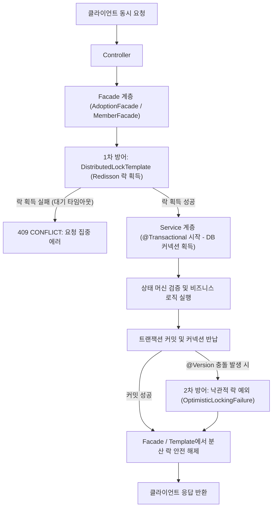

# 🐾 PawMate - 유기동물 입양 & 커뮤니티 플랫폼 백엔드

> **"기술로 유기동물 문제를 해결하고 더 나은 입양 문화를 만든다"**  
> 유기동물과 입양 희망자를 안전하고 투명하게 연결하는 풀스택 웹 플랫폼의 백엔드 서비스입니다.  
> Spring Boot 3.5와 Java 17을 기반으로 구축되었으며, 회원 관리, 이메일 인증, 카카오 소셜 로그인, JWT/Redis 토큰 관리, Redisson 분산 락 기반 동시성 제어, 보호 동물의 입양 상태 머신 및 계층형 대댓글 커뮤니티 기능을 제공합니다.

---

## 🔧 기술 스택 (Tech Stack)

### Backend Framework & Language
- **Language**: Java 17 (OpenJDK 17)
- **Framework**: Spring Boot 3.5.3
- **Build Tool**: Gradle 8.x
- **Config Management**: Dotenv (`io.github.cdimascio:dotenv-java 3.0.0`) 기반 `.env` 환경변수 자동 로드

### Security & Authentication
- **Security**: Spring Security (Method Security `@PreAuthorize`, `@AuthenticationPrincipal` 적용)
- **OAuth2**: Spring Security OAuth2 Client (Kakao) & 카카오 소셜 계정 자동 연동 (Link Account)
- **Token**: JWT (`jjwt 0.11.5` HMAC-SHA512), Redis 기반 Refresh Token 관리 및 Blacklist 로그아웃 / 탈퇴 무효화
- **Password**: BCryptPasswordEncoder

### Database & Persistence
- **ORM**: Spring Data JPA, Hibernate 6
- **Database**: MySQL 8.0 (운영/개발), H2 (테스트 인메모리)
- **Auditing & Soft Delete**: 
  - `BaseTimeEntity` 공통 상속 (생성일시/수정일시 및 `is_deleted` 자동 관리)
  - Hibernate 6 `@SQLDelete` & `@SQLRestriction("is_deleted = false")` 적용 (데이터 이력 영구 보존 및 FK 무결성 보장)
- **쿼리 성능 최적화**: `@EntityGraph` 및 `Fetch Join`, `default_batch_fetch_size: 100` 적용 (N+1 문제 원천 차단)

### Cache & Concurrency Control
- **Distributed Lock**: Redisson (`RLock`, Pub/Sub 기반 분산 락)
- **Lock Architecture**: `Facade` 및 `DistributedLockTemplate` 패턴 (락 라이프사이클과 DB 트랜잭션의 관심사 완전 분리)
- **Optimistic Lock**: JPA `@Version` (엔티티 동시 수정 및 Lost Update 방지)
- **State Machine**: 입양 상태 전이 유효성 검증 및 다중 신청 연쇄 처리 (승인 시 타 신청 자동 반려)
- **Cache / In-Memory DB**: Redis (Spring Data Redis, Lettuce, SSL 지원)
- **Mail**: JavaMailSender (Gmail SMTP 이메일 인증 및 비밀번호 재설정)
- **API Documentation**: SpringDoc OpenAPI UI (Swagger 3)

---

## 📁 프로젝트 구조 (Package Structure)

```
com.kindtail.adoptmate
├── 📂 adoption         # 입양 신청, 상태 머신, 승인/반려 (Facade & 분산 락)
├── 📂 animal           # 보호 동물 등록, 조회, 종별 필터링
├── 📂 auth             # JWT 토큰 생성/검증, OAuth2 소셜 로그인, 시큐리티 필터
├── 📂 comment          # 계층형 대댓글 (부모-자식 트리 구조)
├── 📂 common           # 공통 응답 DTO, 예외 처리, 분산 락 템플릿, BaseTimeEntity
├── 📂 config           # Security, Redis, Swagger, Email, WebConfig
├── 📂 member           # 회원가입, 로그인, 정보 조회, 이메일 인증, 회원 탈퇴
└── 📂 post             # 커뮤니티 게시글 CRUD 및 페이징
```

---

## 🚀 주요 기능 및 핵심 비즈니스 로직

### 🔐 1. 인증 및 회원 관리
- **JWT 기반 무상태(Stateless) 인증**: Access Token(1시간)과 Refresh Token(7일) 기반의 보안 아키텍처
- **Redis 연동 토큰 관리 & 철저한 무효화**:
  - 사용자별 Refresh Token을 Redis에 보관하여 토큰 갱신 지원
  - 로그아웃 및 **회원 탈퇴 시** Access Token 잔여 시간만큼 Blacklist에 등록하여 탈취된 토큰 즉시 무효화
- **이메일 인증 시스템**: 6자리 난수 코드를 Redis에 3분간 캐싱하여 검증 (5회 실패 시 30분 차단)
- **비밀번호 재설정 & 변경**:
  - 미로그인 회원: 이메일 인증 확인 토큰 기반의 안전한 2단계 비밀번호 변경 (`PATCH /adoptmate/password`)
  - 로그인 회원: 현재 비밀번호 검증 기반 안전 변경 (`POST /adoptmate/password`, 응답에 평문 비밀번호 노출 원천 차단)
- **카카오 OAuth2 소셜 로그인 & 계정 자동 연동**:
  - 표준 OAuth2 Authorization Code Grant 방식으로 사용자 정보 연동
  - 기존 일반 이메일 가입 유저가 카카오 로그인 시 `socialProvider` 및 `socialId` 자동 연동 (중복 키 에러 방지)
- **안전한 논리 삭제(Soft Delete)**: 회원 탈퇴 시 기존 작성 글/입양 이력 보존 및 이메일 유니크 인덱스 충돌 방지 (`email = CONCAT('deleted_', id, '_', email)`)
- **`@AuthenticationPrincipal` 표준 주입**: 컨트롤러에서 인증 객체를 안전하고 Type-safe하게 주입받아 비즈니스 계층에 전달

### 🐶 2. 보호 동물 관리
- 보호 동물 등록, 상세 조회 및 페이징 목록 조회 (기본 `page=0, size=10` 안전 폴백)
- 종별(강아지/고양이/기타) 필터링 조회
- 보호 상태 변경(`PROTECTED` ➡️ `WAITING` ➡️ `ADOPTED`) 및 안전한 논리 삭제 (관리자 권한 `@PreAuthorize("hasRole('ADMIN')")` 제어)

### 🏡 3. 입양 신청 & 상태 머신 관리
- 입양 신청서 제출 (연락처, 주거 형태, 반려동물 유무, 입양 사유 등 세분화된 정보 수집)
- 동물-회원 간 중복 입양 신청 방지 (`uniqueConstraints`, 분산 락 및 서비스 레벨 검증)
- 신청 접수 시 보호 동물 상태가 `WAITING(대기)`으로 자동 전환
- **입양 상태 머신(State Machine) 및 연쇄 처리**:
  - **상태 전이 검증**: `PENDING`(대기) 상태인 신청만 심사 가능하며, 이미 완료된 신청의 중복/역방향 변경 원천 차단
  - **승인(`APPROVED`) 시 연쇄 처리**: 동물 상태를 `ADOPTED`로 갱신하고, 동일 동물에 대한 타 신청건들을 자동으로 `REJECTED`(반려) 처리
  - **반려(`REJECTED`) 시 스마트 복구**: 잔여 대기자 유무를 파악하여 대기자가 없으면 `PROTECTED`(입양 가능)로 복귀, 대기자가 남아있으면 `WAITING` 유지
- **동물 단위 락 동기화 (`animal:{id}`)**: 신청 접수뿐만 아니라 심사 승인/반려 시에도 동일 동물 기준 분산 락을 획득하여 연쇄 반려의 데이터 무결성 보장
- **권한 기반 입양 관리**:
  - 일반 사용자: 본인이 신청한 입양 내역 조회 (`/adoptions/myAdoption`)
  - 관리자: 전체 입양 신청 내역 조회 및 상태 심사/승인/반려 (`/adoptions/all`, `/adoptions/list`, `/adoptions/{id}/status`)

### 💬 4. 커뮤니티 & 계층형 대댓글
- 입양 후기 및 자유 게시글 작성, 페이징 목록 조회, 상세 조회, 수정, 삭제
- **계층형 대댓글 구조**: 부모-자식 트리 구조로 무제한 뎁스의 답글 지원
- **N+1 쿼리 최적화**: `@EntityGraph(attributePaths = {"member", "children", "children.member"})` 및 `@BatchSize`를 통한 쿼리 최적화
- **작성자/관리자 인가 검증**: 게시글 및 댓글 수정·삭제 시 작성자 본인 또는 관리자만 가능하도록 철저한 검증

---

## 🛡️ 동시성 제어 & 데이터 무결성 아키텍처 (Concurrency & Integrity)

대규모 트래픽 및 동시 다중 요청 환경에서 **데이터 무결성(Data Integrity)**을 보장하기 위해 **Redisson 분산 락(Facade/Template), JPA 낙관적 락, Soft Delete의 다계층 방어 전략**을 구축했습니다.



### 1. 트랜잭션과 분산 락의 생명주기 및 관심사 분리 (`Facade & DistributedLockTemplate`)
* **문제 배경**: AOP 기반 락 적용 시 발생할 수 있는 DB 커넥션 점유 낭비, SpEL 파싱 런타임 위험, AOP 프록시 내부 호출 제약을 방지하고 계층별 책임을 명확히 분리합니다.
* **해결 구조**:
  1. **Facade 계층**(`AdoptionFacade`, `MemberFacade`)에서 `DistributedLockTemplate`을 통해 Redis 분산 락을 먼저 획득 (DB 커넥션 미사용)
  2. 락 획득 성공 후 **Service 계층**(`@Transactional`)으로 진입하여 DB 트랜잭션 시작 및 비즈니스 로직 수행
  3. Service 메서드 종료와 함께 **DB 트랜잭션 커밋 완료 & 커넥션 즉시 반납**
  4. Template의 `finally` 블록에서 **Redis 분산 락 안전 해제**
  👉 **락 대기 시간 동안 DB 커넥션 풀을 낭비하지 않으며, 트랜잭션 커밋 후 락 해제를 완벽하게 보장**합니다.

### 2. 데이터 무결성을 위한 논리 삭제 (Soft Delete) 전략
* **외래키 제약조건 보호**: 회원 탈퇴나 동물/게시글 삭제 시 물리 행을 삭제하지 않고 `@SQLDelete`로 `is_deleted = true` 처리하여 기존 입양 이력과의 외래키(FK) 무결성 유지
* **연쇄 삭제 충돌 방지**: 부모 엔티티 삭제 시 불필요한 `CascadeType.REMOVE` 연쇄 쿼리를 제거하여 데이터 이력 보존
* **자동 필터링**: Hibernate 6 `@SQLRestriction("is_deleted = false")`를 적용하여 모든 서비스 쿼리에서 삭제된 데이터 자동 제외
* **유니크 인덱스 충돌 방지**: 회원 탈퇴 시 `email`에 `deleted_{id}_` prefix를 부여하여 탈퇴 회원의 이메일로 재가입 허용

### 3. 주요 적용 도메인
| 도메인 | 적용 기술 / 계층 | 락 키 (Type-safe) / 정책 | 목적 |
| :--- | :--- | :--- | :--- |
| **입양 신청 (`applyAdoption`)** | `AdoptionFacade` + Redisson 락 | `'animal:' + animalId` | 단일 보호 동물에 대한 동시 중복 신청 차단 |
| **입양 승인/반려 (`updateStatus`)** | `AdoptionFacade` + 상태 머신 | `'animal:' + animalId` | 상태 전이 유효성 보장, 동물 상태 전이 및 연쇄 반려 무결성 완벽 보장 |
| **회원 가입 (`registerMember`)** | `MemberFacade` + Redisson 락 | `'register:' + email` | 동일 이메일 동시 가입 요청 시 중복 생성 및 500 에러 차단 |
| **보호 동물/신청/게시글** | JPA 낙관적 락 (`@Version`) | `version` 컬럼 | 동시 수정 충돌 시 `409 Conflict` 감지 및 데이터 무결성 보장 |
| **전체 엔티티 삭제** | Hibernate Soft Delete | `is_deleted` + `@SQLRestriction` | 데이터 이력 영구 보존 및 연관 관계 외래키 충돌 방지 |
| **이메일 인증 시도** | Redis 원자 연산 (`INCR`) | `email_verify:attempt:{email}` | Read-Modify-Write 결함 제거로 5회 실패 차단(Brute-Force 방어) 완벽 보장 |

---

## ⚙️ 환경 설정 및 실행 가이드 (Getting Started)

### 1. 환경 변수 설정 (`.env`)
프로젝트 루트에 `.env` 파일을 생성하거나 `.env.example`을 복사하여 작성합니다. (애플리케이션 구동 시 자동 로드)

```properties
# Spring Profile & Server
SPRING_PROFILES_ACTIVE=local
SERVER_PORT=8000

# Database (MySQL)
DB_HOST=localhost
DB_PORT=3306
DB_NAME=adoptpet_db
DB_USERNAME=root
DB_PASSWORD=your_password
JPA_DDL_AUTO=update

# Redis
REDIS_HOST=localhost
REDIS_PORT=6379
REDIS_PASSWORD=

# Kakao OAuth2
KAKAO_CLIENT_ID=your_kakao_client_id
KAKAO_CLIENT_SECRET=your_kakao_client_secret
KAKAO_REDIRECT_URI=http://localhost:8000/adoptmate/kakao

# Mail (Gmail SMTP)
MAIL_HOST=smtp.gmail.com
MAIL_PORT=587
MAIL_USERNAME=your_email@gmail.com
MAIL_PASSWORD=your_gmail_app_password

# JWT Token
JWT_EXPIRATION=3600
JWT_SECRET_KEY=your_jwt_secret_key_at_least_64_bytes_long_string_1234567890
JWT_EXPIRATION_RT=604800
JWT_SECRET_KEY_RT=your_jwt_refresh_secret_key_at_least_64_bytes_long_string_1234567890

# Client URL
CLIENT_URL=http://localhost:5173
```

### 2. 로컬 실행
```bash
# 빌드 및 실행
./gradlew bootRun
```

### 3. Docker Compose 실행
```bash
# 전체 컨테이너(MySQL, Redis, Backend) 빌드 및 실행
docker compose up -d --build
```

### 4. 전체 테스트 실행 (142 Tests)
```bash
./gradlew test
```

---

## 📊 데이터베이스 다이어그램 (ERD)


---

## 📋 REST API 명세서

### 📦 공통 응답 포맷 (`CommonResDto`)

```json
{
  "statusCode": 200,
  "statusMessage": "성공 메시지",
  "result": { ... }
}
```

---

### 👤 1. 회원 & 인증 API (`/adoptmate`)

| 메서드 | URL | 권한 | 설명 | Request Body / Params | Response Data |
| :--- | :--- | :--- | :--- | :--- | :--- |
| `POST` | `/adoptmate/register` | Public | 일반 회원가입 (이메일 중복 분산 락) | `MemberRegisterRequestDto` | `MemberResponseDto` (HTTP 201) |
| `POST` | `/adoptmate/login` | Public | 일반 로그인 | `MemberLoginRequestDto` | `MemberLoginResultDto` (HTTP 200) |
| `POST` | `/adoptmate/refresh-token` | Public | Access Token 재발급 | `{"refreshToken": "string"}` | `{"token": "string"}` |
| `POST` | `/adoptmate/logout` | User | 로그아웃 (Redis 토큰 삭제 및 블랙리스트) | Header: `Authorization: Bearer <token>` | `null` |
| `GET` | `/adoptmate/myInfo` | User | 내 프로필 정보 조회 | Header: `Authorization: Bearer <token>` | `MemberInfoResponseDto` |
| `GET` | `/adoptmate/all` | Admin | 전체 회원 목록 조회 | - | `List<MemberInfoResponseDto>` |
| `POST` | `/adoptmate/password` | User | 로그인 상태에서 비밀번호 변경 | `PasswordChangeRequestDto` | `null` |
| `DELETE` | `/adoptmate/delete` | User | 회원 탈퇴 (토큰 즉시 무효화 및 Soft Delete) | Header: `Authorization: Bearer <token>` | `null` |

---

### ✉️ 2. 이메일 인증 & 비밀번호 재설정 API (`/adoptmate`)

| 메서드 | URL | 권한 | 설명 | Request Body / Params | Response Data |
| :--- | :--- | :--- | :--- | :--- | :--- |
| `POST` | `/adoptmate/verify-email` | Public | 회원가입용 인증 코드 이메일 발송 (TTL 3분) | `{"email": "string"}` | `null` |
| `POST` | `/adoptmate/verify-code` | Public | 이메일 인증 코드 검증 (5회 실패 시 30분 차단) | `{"email": "string", "code": "string"}` | `Map<String, String>` |
| `POST` | `/adoptmate/send-reset-code` | Public | 비밀번호 재설정 인증 코드 발송 | Query: `?email={email}` | `null` |
| `POST` | `/adoptmate/verify-reset-code` | Public | 비밀번호 재설정 인증 코드 검증 | Query: `?email={email}&code={code}` | `null` |
| `PATCH` | `/adoptmate/password` | Public | 비밀번호 재설정 실행 (인증 완료 회원) | `PasswordResetRequestDto` | `null` |

---

### 🔑 3. 카카오 소셜 로그인 API (`/adoptmate`, `/oauth2`)

| 메서드 | URL | 권한 | 설명 | Request Params | Response |
| :--- | :--- | :--- | :--- | :--- | :--- |
| `GET` | `/oauth2/authorization/kakao` | Public | Spring Security 카카오 로그인 진입 | - | 카카오 인가 페이지 리다이렉트 |
| `GET` | `/adoptmate/kakao` | Public | 카카오 OAuth2 콜백 엔드포인트 (기존 이메일 회원 자동 연동) | Query: `?code={code}` | HTML (Window postMessage / Redirect) |

---

### 🐶 4. 보호 동물 관리 API (`/animals`)

| 메서드 | URL | 권한 | 설명 | Request Body / Params | Response Data |
| :--- | :--- | :--- | :--- | :--- | :--- |
| `POST` | `/animals/register` | Admin | 보호 동물 등록 | `AnimalCreateRequest` | `AnimalResponse` (HTTP 201) |
| `GET` | `/animals/list` | Public | 보호 동물 전체 목록 조회 (페이징, 기본 `page=0, size=10`) | Query: `?page=0&size=10` | `Page<AnimalResponse>` |
| `GET` | `/animals/species` | Public | 보호 동물 종별 목록 조회 (페이징, 기본 `page=0, size=10`) | Query: `?species=DOG&page=0&size=10` | `Page<AnimalResponse>` |
| `GET` | `/animals/{id}` | Public | 보호 동물 상세 조회 | Path: `id` | `AnimalResponse` |
| `PUT` | `/animals/{id}/status` | Admin | 보호 동물 상태 변경 (`PROTECTED`/`WAITING`/`ADOPTED`) | Path: `id`, Body: `AnimalStatusUpdateRequest` | `AnimalResponse` |
| `DELETE` | `/animals/{id}`, `/animals/delete/{id}` | Admin | 보호 동물 삭제 | Path: `id` | `null` (HTTP 200) |

---

### 🏡 5. 입양 신청 관리 API (`/adoptions`)

| 메서드 | URL | 권한 | 설명 | Request Body / Params | Response Data |
| :--- | :--- | :--- | :--- | :--- | :--- |
| `POST` | `/adoptions/animals/{animalId}` | User | 동물 입양 신청서 제출 (동물 락 `'animal:' + animalId`) | Path: `animalId`, Body: `AdoptionCreateRequest` | `AdoptionResponseDto` (HTTP 201) |
| `GET` | `/adoptions/myAdoption` | User | 본인 입양 신청 내역 조회 | Header: `Authorization: Bearer <token>` | `List<AdoptionResponseDto>` |
| `GET` | `/adoptions/all` | Admin | 전체 입양 신청 내역 조회 (리스트) | Header: `Authorization: Bearer <token>` | `List<AdoptionResponseDto>` |
| `GET` | `/adoptions/list` | Admin | 전체 입양 신청 내역 조회 (페이징) | Header: `Authorization: Bearer <token>`, `?page=0&size=10` | `Page<AdoptionResponseDto>` |
| `PUT` | `/adoptions/{adoptionId}/status` | Admin | 입양 신청 상태 변경 (`APPROVED` / `REJECTED`, 동물 락 동기화) | Path: `adoptionId`, Body: `AdoptionUpdateRequestDto` | `AdoptionResponseDto` |

---

### 📝 6. 커뮤니티 게시글 API (`/post`)

| 메서드 | URL | 권한 | 설명 | Request Body / Params | Response Data |
| :--- | :--- | :--- | :--- | :--- | :--- |
| `POST` | `/post/create` | User | 게시글 작성 | `PostCreateRequestDto` | `PostResponseDto` (HTTP 201) |
| `GET` | `/post/list` | Public | 게시글 목록 조회 (페이징) | Query: `?page=0&size=10&sort=id,desc` | `Page<PostResponseDto>` |
| `GET` | `/post/{postId}` | Public | 게시글 상세 조회 | Path: `postId` | `PostResponseDto` |
| `PUT` | `/post/{postId}` | Author/Admin | 게시글 수정 (작성자 또는 관리자) | Path: `postId`, Body: `PostUpdateRequestDto` | `PostResponseDto` |
| `DELETE` | `/post/{postId}` | Author/Admin | 게시글 삭제 (작성자 또는 관리자) | Path: `postId` | `null` |

---

### 💬 7. 댓글 & 계층형 답글 API (`/comment`)

| 메서드 | URL | 권한 | 설명 | Request Body / Params | Response Data |
| :--- | :--- | :--- | :--- | :--- | :--- |
| `POST` | `/comment/{postId}` | User | 댓글 또는 답글 작성 | Path: `postId`, Body: `CommentDto` | `CommentResponseDto` (HTTP 201) |
| `GET` | `/comment/{postId}` | Public | 특정 게시글 댓글 목록 (계층형 대댓글 트리) | Path: `postId` | `List<CommentResponseDto>` |
| `PUT` | `/comment/{commentId}`, `/comment/update/{commentId}` | Author/Admin | 댓글 수정 (작성자 또는 관리자) | Path: `commentId`, Body: `CommentUpdateDto` | `CommentResponseDto` |
| `DELETE` | `/comment/{commentId}` | Author/Admin | 댓글 삭제 (작성자 또는 관리자) | Path: `commentId` | `null` |
